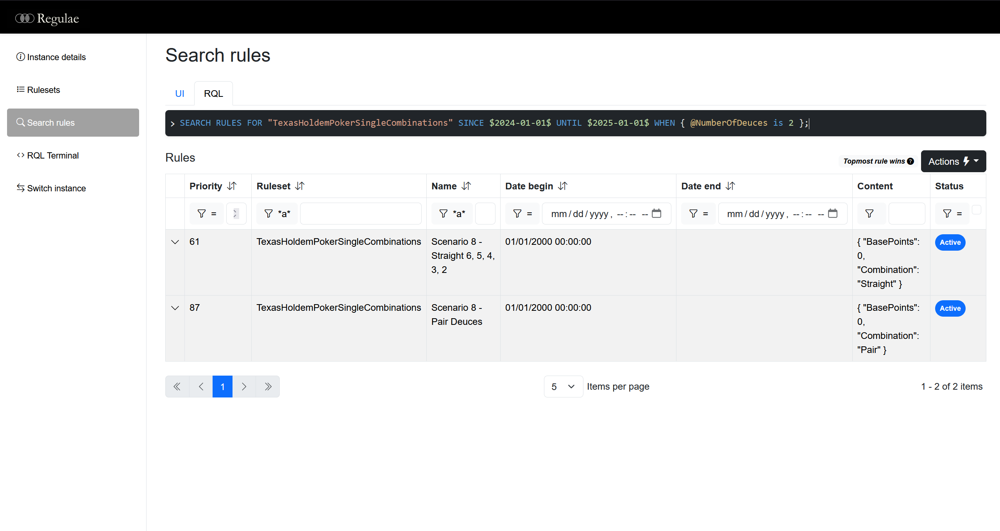

# Regulae


Regulae is a general purpose library that allows defining, evaluating, and managing rules for complex business scenarios. 

[](https://github.com/luispfgarces/regulae/actions/workflows/dotnet-build.yml)

## What is a rule

A rule is a data structure limited in time (`date begin` and `date end`), and that is categorized by a `ruleset`. Its applicability is constrained by `conditions`, and a `priority` value is used as untie criteria when there are multiple rules applicable.

## Why use rules

By using rules, we're able to abstract a multiplicity of business scenarios through rules configurations, instead of heavy code developments. Rules enable a fast response to change and a better control of the business logic by the product owners.

## Regulae package
[](https://www.nuget.org/packages/Rules.Framework/)

The Regulae package contains the core of the rules engine. It includes an in-memory provider for the rules data source.

### Basic usage

Build the engine with the `RulesEngineBuilder`.

```csharp
var rulesEngine = RulesEngineBuilder.CreateRulesEngine()
    .SetInMemoryDataSource()
    .Build();
```
Use the `Rule` fluent builder to assemble a rule.

```csharp
var ruleForPremiumFreeSample = Rule.Create("Rule for perfume sample for premium clients.")
    .InRuleset("FreeSample")
    .SetContent("SmallPerfumeSample")
    .Since(new DateTime(2020, 01, 01))
    .ApplyWhen("ClientType", Operators.Equal, "Premium")
    .Build();
```

Add a rule to the engine with the `AddRuleAsync()`.

```csharp
await rulesEngine.AddRuleAsync(ruleForPremiumFreeSample.Rule, RuleAddPriorityOption.ByPriorityNumber(1));
```

Get a matching rule by using the `MatchOneAsync()` and passing a date and conditions.

```csharp
var matchingRule = await rulesEngine.MatchOneAsync(
        "FreeSample", 
        new DateTime(2021, 12, 25), 
        new Dictionary<string, object>
        {
            { "ClientType", "Premium" }
        });
```

### Complex scenarios

For a more thorough explanation of the Regulae library and all it enables, check the [Wiki](https://github.com/luispfgarces/regulae/wiki). 

Check also the test scenarios and samples available within the source-code, to see more elaborated examples of its application.

## Regulae.Providers.MongoDb package
[](https://www.nuget.org/packages/Rules.Framework.Providers.MongoDb/)

To keep rules persisted in a MongoDB database, use the extension method in the Providers.MongoDB package to pass your MongoClient and MongoDbProviderSettings to the `RulesEngineBuilder`.

```csharp
var rulesEngine = RulesEngineBuilder.CreateRulesEngine()
    .SetInMongoDBDataSource(mongoClient, mongoDbProviderSettings)
```

## Regulae.WebUI package
[](https://www.nuget.org/packages/Rules.Framework.WebUI/)

The WebUI package offers a way of visualizing the rules in your web service. To configure the UI, pass the rules engine as generic to the `IApplicationBuilder` extension method provided.

```csharp
builder.Services.AddControllersWithViews()
    .AddRegulaeWebUI(registrar =>
    {
        registrar
            .AddInstance(
                "Sample 1",
                (serviceProvider, name) =>
                {
                    // Logic to get rules engine
                })
            .AddInstance(
                "Sample 2",
                async (serviceProvider, name) =>
                {
                    // Async alternative also available
                });
    });

...

app.UseRegulaeWebUI();
```

Access is done via the endpoint `{host}/regulae-ui`.



## Features

The following list presents features available:
- Rules evaluation
    - Interpreted
    - Pre-compiled
- Evaluation modes
    - Match one
    - Match many
- Rules content serialization
- Rules management (Create, Read, Update)
- Data source providers
    - In-memory
    - MongoDB
- Rule Query Language
    - Type system
        - Support for objects (prototyping)
    - Match sentences
    - Search sentences
    - Language assist support
- WebUI
    - View multiple rules engine instances
    - List rulesets
    - List/search rules
        - RQL support with auto-complete using language assist
    - RQL terminal
        - Auto-complete using language assist

## Documentation

See the [full documentation](https://luispfgarces.github.io/regulae/) for an in-depth walthrough on Regulae usage and features.

## Contributing

Contributions are more than welcome! Submit comments, issues or pull requests, we promise to keep an eye on them :)

Head over to [CONTRIBUTING](CONTRIBUTING.md) for further details.

## License

[MIT License](LICENSE.md)
